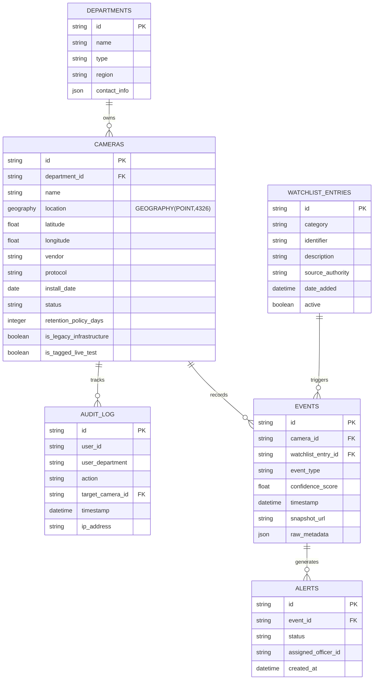
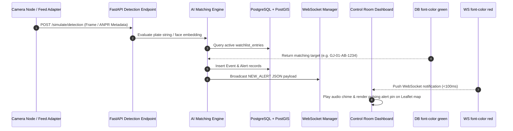

# High-Level Architecture & System Design Document

**PROJECT**: SentinelGrid — CCTV Registry, GIS & Watchlist Analytics Platform  
**SUBMITTED FOR**: Gujarat Police Innovation Challenge 2026 (Sentinel)  
**PROBLEM ID**: KANADSHIELD26_P2_10  

---

## 1. Executive Summary & Tech Stack Rationale

SentinelGrid is a unified state-wide CCTV registry, PostGIS spatial gap analysis, department-scoped RBAC, real-time AI alert streaming, and chronological GIS vehicle route tracking platform engineered specifically to satisfy the acceptance criteria of the Gujarat Police Innovation Challenge 2026.

### Tech Stack Rationale (Tied to Portal Mandates)

| Stack Component | Specified Technology | Engineering Justification |
| :--- | :--- | :--- |
| **GIS Mapping** | **Leaflet.js** + **PostGIS** | Primary specified mapping library. Provides lightweight, responsive tile rendering and seamless integration with PostGIS spatial queries (`GEOGRAPHY(POINT,4326)`). |
| **Backend Framework** | **Python + FastAPI** | Chosen over Node.js for native async WebSocket support and direct access to Python OpenCV / ONNX AI pipelines without cross-language boundary latency. |
| **Spatial Database** | **PostgreSQL + PostGIS** | Enforces true spatial indexing on camera coordinates, enabling real-time `ST_DWithin` spatial gap analysis and route query joins. Avoids crude lat/lng float math. |
| **Frontend Framework** | **React.js + Vite** | Specified portal framework. Offers high-performance component rendering, smooth glassmorphism dark mode UI, and rapid Vite dev build tooling. |
| **Access Control** | **Department-Scoped RBAC** | JWT-based claims scoped per department (Police, RTO, Food & Civil Supplies, Municipal Corp, Mining), with audited cross-department access tracking. |
| **Real-time Pipeline** | **FastAPI WebSockets** | Native async WebSocket broadcasting for sub-100ms alert push to connected control room dashboards. |
| **Orchestration** | **Docker Compose** | Single-command deployment (`docker-compose up`) packaging PostGIS, FastAPI, and React Vite. |

---

## 2. High-Level Architecture Diagram

```mermaid
graph TD
    subgraph Frontend [React.js + Vite + Leaflet.js Frontend Dashboard]
        GIS[GIS Registry Portal & Uncovered Zones]
        ONB[Camera Onboarding - Manual & Bulk CSV]
        LIVE[Live Ops WebSocket Dashboard]
        TRACK[Vehicle Route Tracking - Step 4 Centerpiece]
        WATCH[Watchlist Management]
        AUDIT[Audit Trail & DR Failover Controls]
    end

    subgraph Backend [Python FastAPI Backend Engine]
        AUTH[JWT Department RBAC Auth]
        CAM_ROUTER[Camera Registry & PostGIS Spatial API]
        WATCH_ROUTER[Watchlist & Searchable Events API]
        TRACK_ROUTER[Chronological Vehicle Track API]
        MATCH_ENG[AI Matching Engine: ANPR / Face Cosine Sim]
        WS_MGR[WebSocket Alert Stream Manager]
        ADAPTERS[RTSP Local & Govt REST Feed Adapters]
    end

    subgraph Database [PostgreSQL + PostGIS 3.3]
        DB_DEPTS[(departments)]
        DB_CAMS[(cameras - GEOGRAPHY POINT 4326)]
        DB_AUDIT[(audit_log)]
        DB_WATCH[(watchlist_entries)]
        DB_EVENTS[(events)]
        DB_ALERTS[(alerts)]
    end

    GIS -->|HTTP REST| CAM_ROUTER
    ONB -->|HTTP REST / CSV Bulk| CAM_ROUTER
    LIVE -->|WebSocket| WS_MGR
    TRACK -->|HTTP REST| TRACK_ROUTER
    WATCH -->|HTTP REST| WATCH_ROUTER
    AUDIT -->|HTTP REST| AUTH

    ADAPTERS -->|Ingest Frames| MATCH_ENG
    MATCH_ENG --> DB_EVENTS
    MATCH_ENG --> DB_ALERTS
    MATCH_ENG --> WS_MGR

    CAM_ROUTER --> DB_CAMS
    CAM_ROUTER --> DB_AUDIT
    TRACK_ROUTER --> DB_EVENTS
    TRACK_ROUTER --> DB_CAMS
```

---

## 3. Hybrid Model Justification (Model 1 + Model 3)

The challenge prompt evaluated four potential operating models:
- **Model 1**: Standalone CCTV Metadata Registry & GIS Map
- **Model 2**: Isolated VMS Video Management Streamer
- **Model 3**: Watchlist Analytics & ANPR Intercept Engine
- **Model 4**: Decentralized Local NVR Feed Viewer

### Why Model 1 + Model 3 Hybrid Was Chosen

| Criteria | Model 1 Alone | Model 3 Alone | Model 1 + Model 3 Hybrid (SentinelGrid) |
| :--- | :--- | :--- | :--- |
| **Spatial Gap Analysis** | ✅ Excellent PostGIS gap query | ❌ Lacks spatial registry | ✅ Complete PostGIS spatial gap analysis |
| **Vehicle Tracking** | ❌ Static locations only | ⚠️ Disconnected events | ✅ Chronological GIS route line on real cameras |
| **Inter-Department RBAC** | ✅ Registry ownership rules | ❌ No dept ownership | ✅ Department-scoped claims + audit trail |
| **Real-time Intercept** | ❌ Passive metadata only | ✅ Active alerts | ✅ Active WebSocket alert ticker with GIS pins |

SentinelGrid combines **Model 1** (to establish camera spatial ownership, uncovered zone analysis, and audit trails) with **Model 3** (to run real-time ANPR / face matching against watchlist targets and visualize chronological vehicle movement).

---

## 4. Entity-Relationship Diagram (ERD)

---

## 5. Real-Time Alert & Matching Sequence Diagram

