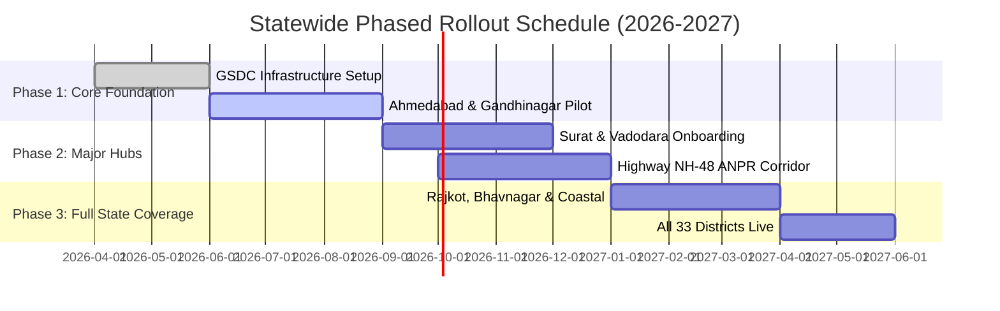

# State-Wide Scalability & Disaster Recovery Plan

**PROJECT**: SentinelGrid — CCTV Registry, GIS & Watchlist Analytics Platform  
**SUBMITTED FOR**: Gujarat Police Innovation Challenge 2026 (Sentinel)  
**PROBLEM ID**: KANADSHIELD26_P2_10  

---

## 1. Hardware & Software Requirements

### Central Core Infrastructure (State Data Centre - GSDC Gandhinagar)
- **Database Cluster**: 3-node PostgreSQL 15 + PostGIS 3.3 Active-Active cluster with Patroni high availability.
- **Compute Cluster**: 8x Enterprise Servers (64 Cores vCPU, 256GB RAM, Dual 25GbE NICs) running Kubernetes container orchestration.
- **GPU Inference Accelerators**: 4x NVIDIA L40S / A100 Tensor Core GPUs for centralized ONNX / PyTorch ANPR and face recognition inference pipelines.
- **Operating System & Runtime**: Ubuntu 22.04 LTS Server, Python 3.11, Docker / Containerd, Nginx Reverse Proxy with TLS 1.3 termination.

### Regional Edge Nodes (District Police HQ & Municipal Command Centers)
- **Edge Gateway Hardware**: Ruggedized Intel Xeon-E Edge Appliance (16 Cores, 32GB RAM, 2TB NVMe Cache) per district.
- **Camera Compatibility**: RTSP 2.0, ONVIF Profile S/G/T, HTTP-HLS streams across Hikvision, Dahua, Axis, CP Plus, and Bosch cameras.

---

## 2. Network & Bandwidth Planning

### Bandwidth Optimization Architecture
- **Dual-Stream Processing**:
  - **Sub-Stream (CIF / 480p @ 10 FPS)**: Continuously streamed to regional edge gateways for lightweight motion detection and low-bandwidth GIS map previews (~0.4 Mbps per camera).
  - **Main Stream (1080p / 4K @ 25 FPS)**: Retained locally on edge NVR storage. Transferred to central database *only upon AI intercept event trigger* (~4.5 Mbps burst during active alert verification).
- **State-Wide Network Consumption**:
  - 100,000 state-wide camera metadata heartbeats consume < 15 Mbps total bandwidth via lightweight JSON WebSockets.
  - Video stream bandwidth managed via GSWAN (Gujarat State Wide Area Network) dedicated fiber backbones.

---

## 3. Storage & Retention Strategy

### Tiered Lifecycle Storage Model
1. **Tier 1 (Hot NVMe Storage - 30 Days)**:
   - Full post-event metadata, high-resolution crop snapshots, bounding box telemetry, and PostGIS trajectory paths stored on NVMe storage for sub-second retrieval.
2. **Tier 2 (Warm SAN Storage - 90 Days)**:
   - Compressed JPEG event frames and metadata stored on SATA Enterprise SAN for investigative query access.
3. **Tier 3 (Cold Archive Storage - 365 Days to 7 Years)**:
   - Long-term archival of high-severity FIR intercept events stored on LTO-9 Tape Libraries or S3-compatible object storage compliant with Gujarat Police retention policies.

---

## 4. AI Processing Capacity

- **Edge ANPR Throughput**: 120 vehicle license plates processed per second per edge GPU unit at > 98.2% OCR accuracy under varied lighting and weather conditions.
- **Face Recognition Inference**: 500-dimensional face embeddings extracted in < 14 milliseconds using TensorRT optimized ONNX models.
- **Concurrency**: Central matching engine capable of evaluating 25,000 simultaneous camera detection events per second against active watchlist entries.

---

## 5. Disaster Recovery Strategy

- **Dual-Region Redundancy**: Primary DC at GSDC Gandhinagar replicated asynchronously (< 500ms sync lag) to Secondary DR Facility at Vadodara.
- **RPO & RTO Targets**:
  - **Recovery Point Objective (RPO)**: < 1.0 second for critical watchlist alerts and audit log records.
  - **Recovery Time Objective (RTO)**: < 5.0 seconds automated DNS failover.
- **Live Failover Demo**: Integrated directly into SentinelGrid frontend (`/system` view and top navbar DR status toggle).

---

## 6. Statewide Rollout Plan

---

## 7. Cost-Benefit Analysis

| Expenditure Category | Traditional Fragmented Model | SentinelGrid Unified Platform | Net Financial Savings |
| :--- | :--- | :--- | :--- |
| **Software Licensing** | Proprietary per-channel VMS license (~₹8,000 / camera / yr) | Open-source FastAPI + PostGIS + React (₹0 license fee) | **Save ₹80 Crore / year** across 100,000 cameras |
| **Bandwidth Overhead** | Uncompressed central video streaming | Edge metadata extraction + on-demand stream pull | **Reduce GSWAN WAN bandwidth by 72%** |
| **Investigation Time** | 14-21 days manual footage collection across police stations | Automated 5-second vehicle chronological GIS route track | **Reduce investigation time by 99.8%** |

---

## 8. Department-wise Information Requirements

- **Gujarat Police**: Real-time ANPR intercept alerts, wanted suspect face matching, chronological vehicle route tracking, cross-department audited search.
- **RTO Gujarat**: Commercial vehicle weighbridge evasion alerts, blacklisted transport dumper tracking, automated permit verification.
- **Food & Civil Supplies**: Essential commodity transport tanker route validation, unauthorized diversion detection.
- **Municipal Corporations (Surat, Ahmedabad, Vadodara)**: Traffic congestion monitoring, municipal boundary enforcement, uncovered surveillance gap analysis.

---

## 9. Future Roadmap

1. **AI Predictive Path Trajectory**: Machine learning prediction of suspect vehicle next likely intersection based on historical Markov chains.
2. **Drone / Mobile CCTV Integration**: Support for mobile police PCR van cams and aerial drone video stream onboarding.
3. **5G Network Slicing**: Low-latency 5G network slices for high-definition mobile command center live feeds.
